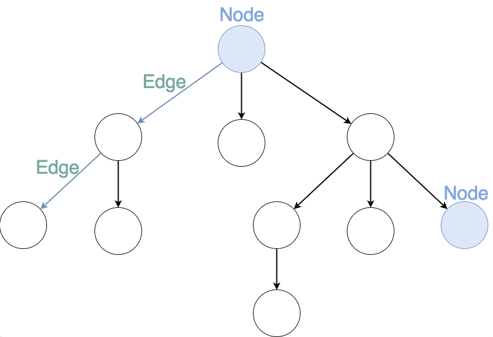
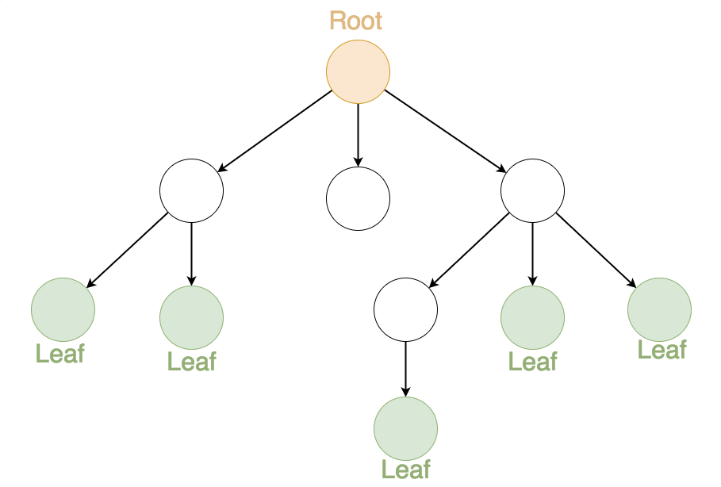
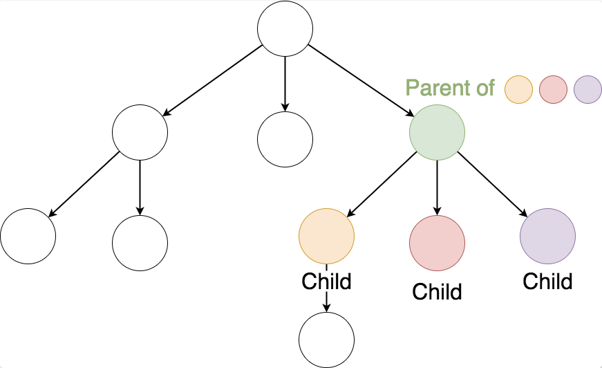
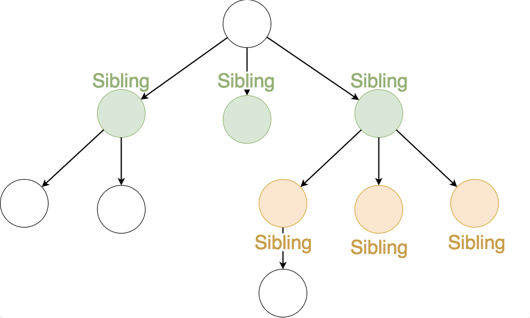
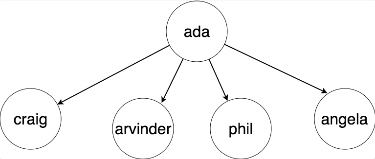

Every app require some sort of data. Sometimes we store data in a single way, such as a string, number, or boolean.

```js
let myString = 'Hello World'
let myNumber = 42
let myBoolean = true
```

Sometimes we need to store data in a more complex way, such as an array or object.

```js
let myArray = [1, 2, 3, 4, 5]
let myObject = {
  name: 'John',
  age: 30,
  isMarried: true,
}
```

Arrays are great to store a list of data, especially when we want to store data in a specific order.

Objects are great when we want to store data in a specific way, but we don't want to store data in a specific order. Objects allow for quick and easy data lookup using they key.

Both arrays and objects are very common in most programming languages. However, there are many other ways of storing and organizing data.

We will look into a commonly used data structure called a **tree**.

## Tree Basics



- each circle is a _node_
  - nodes represent a key entity and contain data about the entity.
- each connection between nodes is called an _edge_

  - edges represent a connection between two nodes.

- the top of the tree is called the _root_
- nodes at the very bottom are called _leafs_
  - leafs do **not** have any children



- Every node expect for the root node has a _parent node_

- Every node that is **not** a leaf has a _child node_



- children with the same parent are called _siblings_



## Tree Example

Imagine we have a company and need to be able to determine the following:

1. Who an employee is reporting to (boss).
2. The total number of people an employee supervises.
3. How many people there are between an employee and the CEO.
4. If two employees share the same boss.

- Each node in this tree is an Employee.
- Every Employee can have many subordinates.
- Every Employee, apart from the CEO, has one boss.

```js
class Employee {
  constructor(name, title, salary) {
    this.name = name
    this.title = title
    this.salary = salary
    this.boss = null
    this.subordinates = []
  }
}
```

> Here we have created an Employee class.

Creating the root and nodes below:

```js
// root
const ada = new Employee('Ada', 'CEO', 3000000.0)

// employees
const craig = new Employee('Craig', 'VP Software', 1000000)
const arvinder = new Employee('Arvinder', 'Chief Design Officer', 1000000)
const angela = new Employee('Angela', 'VP Retail', 1000000)
const phil = new Employee('Phil', 'VP Marketing', 1000000)
```

So far we have 5 nodes, however, none of them are connected to each other. We can modify our class to make this happen by adding a function which pushes the employee to the boss's subordinates array.

```js
class Employee {
  constructor(name, title, salary) {
    this.name = name
    this.title = title
    this.salary = salary
    this.boss = null
    this.subordinates = []
  }

  addSubordinate(subordinate) {
    this.subordinates.push(subordinate)
    subordinate.boss = this
  }
}

// start adding subordinates to the CEO
ada.addSubordinate(craig)
ada.addSubordinate(arvinder)
ada.addSubordinate(angela)
ada.addSubordinate(phil)
```


