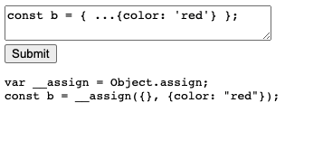

# Understanding ESBuild

Link to ESBuild API documentation: [here](https://esbuild.github.io/api/#transform-api)

We are using `esbuild-wasm` NPM module to compile our code. This is done by using a small amount of JavaScript, feeding it into a WebAssembly binary which will work in the browser. 

ESBuild is written in Go, which can not directly be used in the browser. We need to use a bundler to compile our code into a WebAssembly binary.

## Adding this into our React App

Let's say we have a very basic React app:
```js
import { useState } from 'react';
import ReactDOM from 'react-dom';

const App = () => {
  const [input, setInput] = useState('');
  const [code, setCode] = useState(''); // transpiled code to show in the pre element

  const onClick = () => {
    
  };
  return (
    <div>
      <textarea
        value={input}
        onChange={(e) => setInput(e.target.value)}
      ></textarea>
      <div>
        <button onClick={onClick}>Submit</button>
      </div>
      <pre>{code}</pre>
    </div>
  );
};

ReactDOM.render(<App />, document.getElementById('root'));
```

Go into the 'node-modules' folder and go down to the `esbuild-wasm` folder. You'll find a file called 'esbuild.wasm' which is the WebAssembly binary. We are going to **copy** this file and paste it in our public directory.

This allows us to use ESBuild in our React App.

```js
import * as esbuild from 'esbuild-wasm';
import { useState, useEffect } from 'react';
import ReactDOM from 'react-dom';

const App = () => {
  const [input, setInput] = useState('');
  const [code, setCode] = useState(''); // transpiled code to show in the pre element

  // initialize esbuild
  const startServer = async () => {
    const service = await esbuild.startService({
      worker: true,
      wasmURL: './esbuild.wasm',
    });
    console.log(service);
  };

  // run once when the component is mounted
  useEffect(() => {
    startServer();
  }, []);

  const onClick = () => {};
  return (
    <div>
      <textarea
        value={input}
        onChange={(e) => setInput(e.target.value)}
      ></textarea>
      <div>
        <button onClick={onClick}>Submit</button>
      </div>
      <pre>{code}</pre>
    </div>
  );
};

ReactDOM.render(<App />, document.getElementById('root'));
```

```
{build: ƒ, serve: ƒ, transform: ƒ, stop: ƒ}
  build: S => (g(), $.build(S))
  serve: ƒ serve(S, k)
  stop: ƒ stop()
  transform: ƒ transform(S, k)
  [[Prototype]]: Object
```
> this is the object returned by the `esbuild.startService()` function.

## Using Refs for Arbitrary Values

Recall that Refs provide a way to access DOM nodes or React elements created in the render method, much like the `startServer` we did in the previous example.

```js
import { useState, useEffect, useRef } from 'react';

const App = () => {
  const ref = useRef<any>(); // this is a ref that we can use to access the DOM node
  const [input, setInput] = useState('');
  const [code, setCode] = useState(''); 
  
  const startServer = async () => {
    // can now refer to re.current anywhere in our component we created in ESBuild
    ref.current = await esbuild.startService({
      worker: true,
      wasmURL: './esbuild.wasm',
    });

    //...

  };
```

## Wiring up the transpiler

Very similar code to the Transform API example [here](https://esbuild.github.io/api/#transform-api). 

```js
  const onClick = async () => {
    if (!ref.current) {
      return;
    }

    const result = await ref.current.transform(input, { // transform the input code
      loader: 'jsx',
      target: 'es2015',
    });

    setCode(result.code); // set the transpiled code
  };
```



# Bundling with ESBuild

By default, when we bundle with ESBuild (and Webpack), ESBuild tries to find dependencies on your hard drive. However, we are running ESBuild in the browser! There is no file system access. You can not write JavaScript code to look around in a users computer for the file. 

As it stands, ESBuild will throw an error as soon as we tell it to bundle anything. 

We will need to write a plugin to tell ESBuild to search NPM Registry for the dependencies we want to bundle.

This is very similar to a previous little app [here](https://github.com/Cwarcup/redux-ts-react).

We will be using [UNPKG](https://unpkg.com/) to fetch the dependencies we want to bundle. We are not able to directly download the dependencies from NPM Registry.

unpkg is a fast, global content delivery network for everything on npm. Use it to quickly and easily load any file from any package using a URL like:

```
unpkg.com/:package@:version/:file
```

## Creating ESBuild Plugin

Create a new folder called 'plugins' within 'src'. Create a new file called `unpackage-path-plugin.ts` within the `plugins` folder. Paste the following code. 

```ts
import * as esbuild from 'esbuild-wasm';
  
export const unpkgPathPlugin = () => {
  return {
    name: 'unpkg-path-plugin',
    setup(build: esbuild.PluginBuild) {
    // onResolve is called whenever ESBuild is trying to figure out a path to a particular module.
      build.onResolve({ filter: /.*/ }, async (args: any) => {
        console.log('onResole', args);
        return { path: args.path, namespace: 'a' };
      });
  
      build.onLoad({ filter: /.*/ }, async (args: any) => {
        console.log('onLoad', args);
    // theses are some default values that we can use to get the file
        if (args.path === 'index.js') {
          return {
            loader: 'jsx',
            contents: `
              import message from './message';
              console.log(message);
            `,
          };
        } else {
          return {
            loader: 'jsx',
            contents: 'export default "hi there!"',
          };
        }
      });
    },
  };
};
```

A callback added using onResolve will be run on each import path in each module that esbuild builds. The callback can customize how esbuild does path resolution. For example, it can intercept import paths and redirect them somewhere else. It can also mark paths as external.

A callback added using onLoad will be run for each unique path/namespace pair that has not been marked as external. Its job is to return the contents of the module and to tell esbuild how to interpret it.

Can update our `App` component to use the `unpkgPathPlugin` by adding the following to the `onClick` function.

```js
  const onClick = async () => {
    if (!ref.current) {
      return;
    }

    const result = await ref.current.build({
      entryPoints: ['index.js'],
      bundle: true,
      write: false,
      plugins: [unpkgPathPlugin()],
    });
    // console.log(result);

    setCode(result.outputFiles[0].text); // set the transpiled code
  };
```

